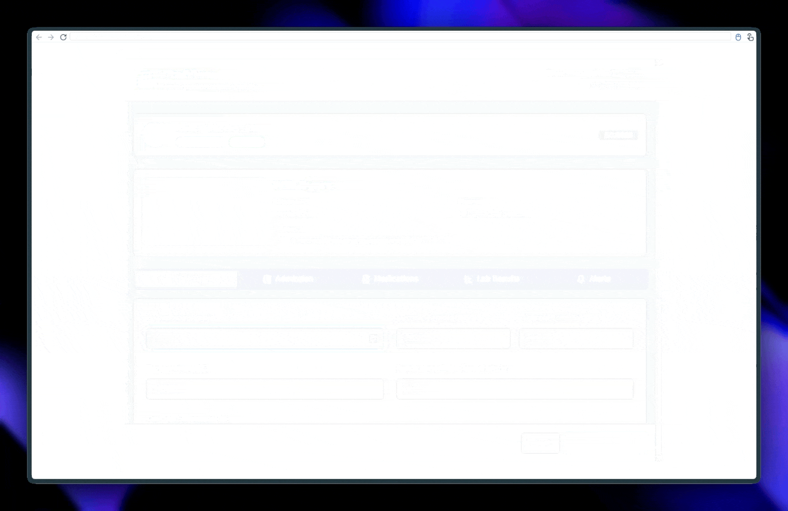
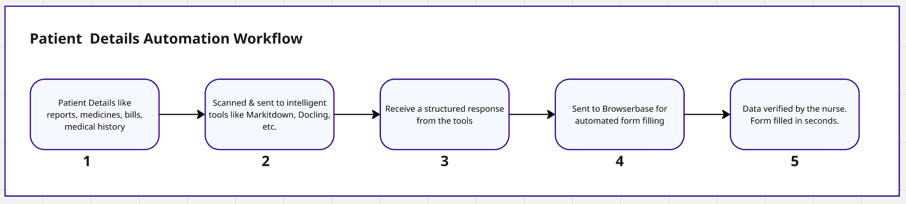

# Automating Patient Dashboard Form Filling with Browserbase & Stagehand

This project (or concept) demonstrates how to automate the often tedious and error-prone process of entering transferred patient data into hospital dashboards using Browserbase and Stagehand.

## Browserbase & Stagehand in Action

## The Problem

When patients are transferred between hospitals, their data often arrives in physical formats (reports, prescriptions). Staff must manually scan these documents, potentially structure the data, and then type it into multiple internal dashboards. This process is:

- Time-consuming: Diverts staff from primary patient care duties.
- Error-prone: Repetitive data entry increases the risk of mistakes.
- Inefficient: A bottleneck in the patient onboarding process.

## The Solution & Workflow
This approach uses Browserbase and Stagehand for intelligent automation. Key advantages are:

- Robust: Less prone to breaking from UI changes than traditional methods.
- AI-Powered: Intelligently fills forms.
- Efficient: Speeds up script development and execution.

---
